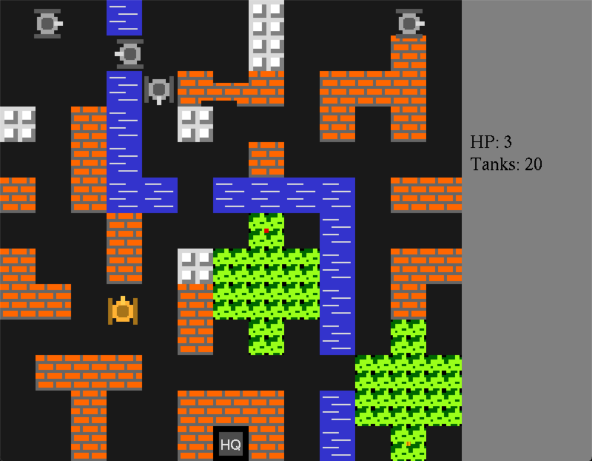

# Battle City - OOP Edition

## Project Overview
This project is a refactored 2D arcade game, based on a classic "Battle City" clone. The original procedural implementation in C (using GLUT) was completely redesigned into a modern C++ architecture using Object-Oriented Programming principles.

The refactoring addresses major architectural flaws such as uncontrolled global state, high coupling, and lack of data encapsulation.

## Key Features
* **OOP Architecture:** Full implementation of encapsulation, inheritance, and polymorphism to manage game entities.
* **Smart Memory Management:** Use of `std::unique_ptr` and standard containers (`std::vector`) to ensure safe resource handling and prevent memory leaks.
* **Advanced AI:** Enemy tanks feature decision-making logic, including wandering, line-of-sight detection, and player hunting.
* **Unit Testing:** Core logic (collisions, damage, upgrades) is covered by a Google Test (gtest) suite.

## Class Structure
The system is built around a clear hierarchy of responsibilities:

| Class | Description |
| :--- | :--- |
| **Game** | Manager class controlling the game loop, state (Playing, Win, GameOver), and object collections. |
| **GameObject** | Abstract base class defining the interface (`update`, `draw`, `isAlive`) for all dynamic entities. |
| **Map** | Encapsulates the game world, handles file loading, rendering, and collision detection. |
| **Tank** | Base class for tanks implementing movement, health, and shooting mechanics. |
| **PlayerTank** | Specialized tank that processes user input for movement and firing. |
| **EnemyTank** | AI-controlled tank with autonomous behavior and targeting logic. |
| **Projectile** | Manages bullet physics, damage, and owner tracking. |

## Build and Execution

### Prerequisites
* **Operating System:** Windows (recommended for full compatibility).
* **IDE:** Visual Studio 2022 (with MSVC v143 compiler).
* **Libraries:** * GLUT (OpenGL Utility Toolkit) for graphics.
    * Google Test (gtest) for running the test suite.

### Setup & Run
1.  **Clone the repository:** Ensure all `.cpp`, `.h`, and `test.txt` files are present in the project directory.
2.  **Open the Solution:** Load `BattleCity_V2.sln` in Visual Studio 2022.
3.  **Configure GLUT:** Verify that the GLUT headers and library paths are correctly linked in the project properties.
4.  **Run the Game:** Set `BattleCity_V2` as the Startup Project and press **F5**.
5.  **Run Tests:** * Switch the startup project to `Sample-Test1`.
    * Use the **Test Explorer** in Visual Studio to execute the unit tests.
    * *Note: Tests use the `RUNNING_TESTS` macro to bypass rendering calls, allowing logic validation without a graphical window.*

## Development Results
The transition to an object model successfully isolated the game state within specific classes. This modularity allows for easy expansion—such as adding new tank types or bonuses—without modifying existing core logic. All unit tests pass, confirming the reliability of the refactored collision and combat systems.